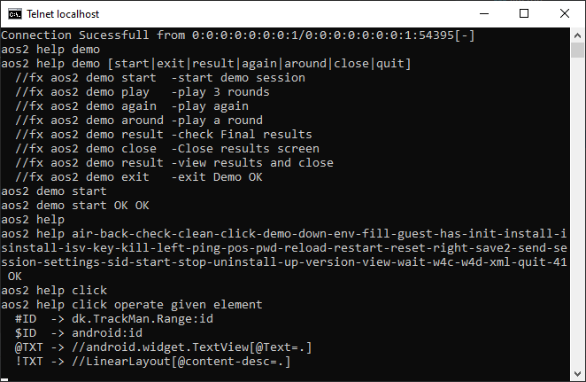

# TrackMan Golf App (Android) Demo

Here is automation setup via using Appium with Java for
Automate playing a Bullseye game in Demo mode as a guest player and verify the final results.


## Task Details

Automate playing a Bullseye game in Demo mode as a guest player:

```
  a. Total number of players: 1
  b. Number of rounds: 3 rounds (As game settings).
  c. validating the score while playing against the final results.
```
    
## Video Demo

Link to video recording [https://us.workplace.datto.com/filelink/680c-7a1f8f6e-8f48e45b8e-2 ]

## Screenshots



## Command & Examples

```bash
telnet localhost 9999
aos2 settings
aos2 init
aos2 view
aos2 save2
aos2 demo start
aos2 demo play
aos2 has @Skip
aos2 help
aos2 help demo
....
bye

```


## System Environment

To run this project, you will need to add the following environment to your System

`Java 8 [8 or 11]`

`APPIUM 1.X[v1.15 or v1.22]`

`Android Emulator[Nexus 6, API-level 30]`

## Run via GitHub Action

Triggger CI/CD pipeline via following workflows

```bash
  https://github.com/ts01soonr/TrackManDemo/blob/main/.github/workflows/run-test.yml
```

## Run Locally

Start Appium & Emulator

```bash
  emulator.exe -verbose -avd [Nexus6] -writable-system -memory 4096
  Appium 
```

Clone the project
```bash
  git clone https://github.com/ts01soonr/TrackManDemo
```

Go to the project directory
```bash
  cd TrackManDemo
```

Start the server

```bash
  start_demo.bat    //for Windows
  start_demo.sh     //for Mac/Linux
  .....
```

Check the server via telnet after server is started

```bash
  telnet localhost 9999
```
Setup AppiumDriver via telnet session

```bash
  aos2 settings
```
Initialize TrackMan APP via telnet session

```bash
  aos2 init
```

If all good, then run scripts for playing a Bullseye game
Initial TrackMan API inside telnet session

```bash
  run jtcom.Dev.TestTrackManDemo
```

## FAQ

#### 1. How to exit telnet session?

Answer: type 'bye' or 'quit' and press Enter 

#### 2. How to stop the server

Answer: type 'stop' and press Enter

#### 3. Can we parse multi command?

Answer: You can copy multiple lines of commands and parse them into the telnet session.

#### 4. Can we run scripts?

Answer: For running scripts, it might be clearer to specify the command to run the script. For example, "To run scripts, create a text file (e.g., 'tests.txt') containing multiple steps, then use the command 'run tests.txt'."

#### 5. Source files for TestTrackManDemo?
Answer: https://github.com/ts01soonr/TrackManDemo/blob/main/src/jtcom/Dev/TestTrackManDemo.java and jtcom/Dev/lib are helper class for running appium as services

#### 6. Can this tool be used for any product?

Answer: Yes, when the server is running, it can perform just like Appium Inspector for both manually testing and automation task. 

#### 7. what is the usage of https://demo.italle.dk?

Answer: This is actually the control system used for managing Github-hosted VMs during execution. [ This is In-house tool just like testclient]

## Feedback

If you have any feedback, please reach out to us at fang@italle.dk
